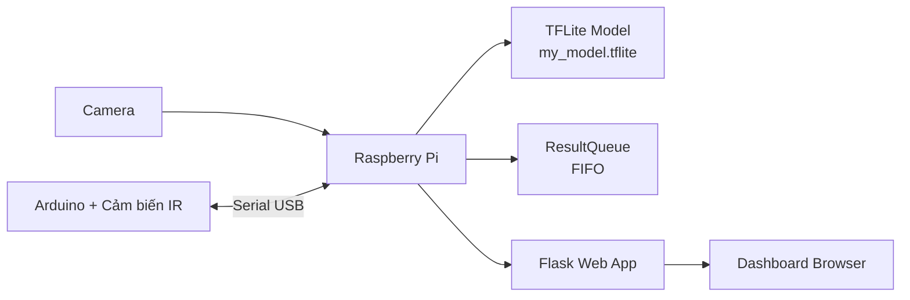
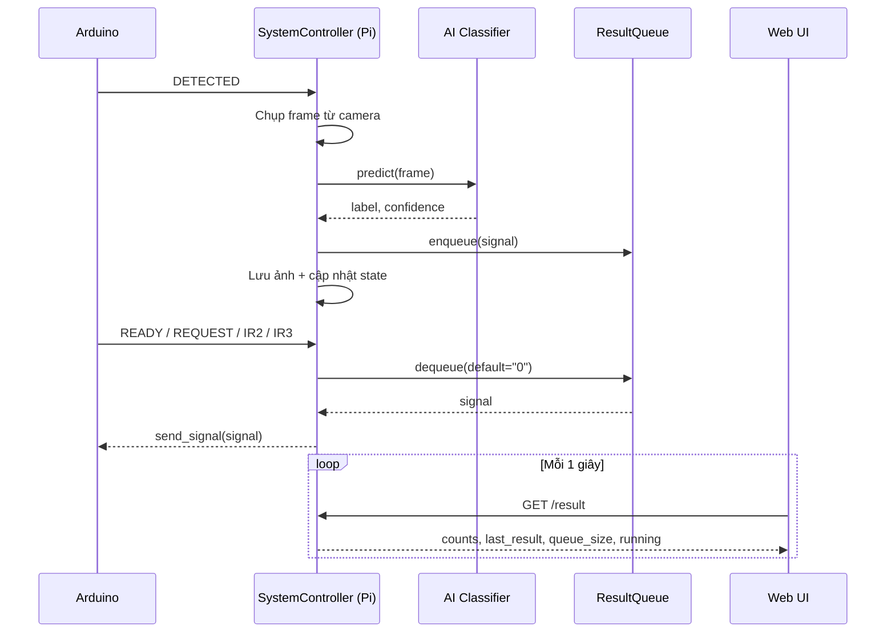

# Hệ Thống Phân Loại Linh Kiện (Raspberry Pi + TensorFlow Lite + Arduino)

## Giới thiệu

Đây là dự án phân loại linh kiện theo thời gian thực, sử dụng camera kết hợp AI (TensorFlow Lite) trên Raspberry Pi, đồng thời giao tiếp với Arduino qua Serial để điều khiển cơ cấu phân loại.

Hệ thống gồm 4 lớp chính:

- Nhận ảnh từ camera.
- Suy luận AI để nhận diện linh kiện.
- Đồng bộ kết quả bằng hàng đợi (queue) theo nhịp cảm biến.
- Hiển thị trạng thái và kết quả qua giao diện web Flask.

## Mục lục

1. [Tính năng nổi bật](#tính-năng-nổi-bật)
2. [Kiến trúc hệ thống](#kiến-trúc-hệ-thống)
3. [Sơ đồ Mermaid](#sơ-đồ-mermaid)
4. [Cấu trúc thư mục](#cấu-trúc-thư-mục)
5. [Yêu cầu môi trường](#yêu-cầu-môi-trường)
6. [Cài đặt](#cài-đặt)
7. [Chạy hệ thống](#chạy-hệ-thống)
8. [API hiện có](#api-hiện-có)
9. [Giao thức Serial Pi-Arduino](#giao-thức-serial-pi-arduino)
10. [Mapping nhãn sang tín hiệu](#mapping-nhãn-sang-tín-hiệu)
11. [Mô tả các module chính](#mô-tả-các-module-chính)
12. [Xử lý sự cố](#xử-lý-sự-cố)
13. [Phụ thuộc](#phụ-thuộc)

## Tính năng nổi bật

- Phân loại linh kiện bằng mô hình `.tflite`.
- Hỗ trợ camera qua OpenCV (ưu tiên) và Picamera2 (dự phòng).
- Đồng bộ kết quả bằng `ResultQueue` để tránh lệch nhịp giữa detect và cơ cấu gạt.
- Giao tiếp serial với Arduino qua `/dev/ttyUSB0`.
- Dashboard web hiển thị:
  - luồng camera,
  - ảnh vừa chụp,
  - số lượng từng loại linh kiện,
  - nhãn và độ tin cậy mới nhất,
  - trạng thái chạy/dừng của hệ thống.

## Kiến trúc hệ thống

Luồng tổng quát:

1. Arduino gửi `DETECTED` khi cảm biến phát hiện vật.
2. Raspberry Pi chụp ảnh, chạy AI, ánh xạ nhãn thành mã tín hiệu (`1`, `2`, `3`) và đưa vào queue.
3. Khi Arduino gửi `READY`/`REQUEST`/`IR2`/`IR3`, Raspberry Pi lấy phần tử đầu queue và gửi ngược lại.
4. Web frontend gọi API định kỳ để cập nhật dữ liệu hiển thị.

## Sơ đồ Mermaid

### 1) Sơ đồ kiến trúc tổng thể



### 2) Sơ đồ luồng xử lý thời gian thực



## Cấu trúc thư mục

```text
PBL5/
|- run.py
|- requirements.txt
|- README.md
|- Models/
|  |- my_model.tflite
|  `- labels.txt
|- src/
|  |- controller.py
|  |- image_processing.py
|  |- model_loader.py
|  |- queue_manager.py
|  `- serial_comm.py
`- Web/
   |- app.py
   |- static/
   |  |- script.js
   |  |- style.css
   |  `- captures/
   `- teamplates/
      `- index.html
```

Lưu ý: thư mục template hiện đang là `teamplates` và Flask cũng đang cấu hình đúng theo tên này.

## Yêu cầu môi trường

- Linux (khuyến nghị Raspberry Pi OS).
- Python 3.10 trở lên.
- Camera hoạt động được với OpenCV hoặc Picamera2.
- Arduino kết nối serial USB tại `/dev/ttyUSB0`.

## Cài đặt

```bash
python3 -m venv .venv
source .venv/bin/activate
pip install --upgrade pip
pip install -r requirements.txt
```

## Chạy hệ thống

Chạy entrypoint chính:

```bash
python run.py
```

Mặc định ứng dụng chạy tại `0.0.0.0:5000`.

Tùy chỉnh host/port bằng biến môi trường:

```bash
HOST=0.0.0.0 PORT=5000 python run.py
```

Truy cập dashboard:

- `http://<IP_RaspberryPi>:5000/`

## API hiện có

- `GET /`: Trang dashboard.
- `GET /video_feed`: Stream camera dạng multipart (frame PNG).
- `GET /latest_frame`: Trả frame JPEG mới nhất (204 nếu chưa có frame).
- `GET /result`: Trả JSON trạng thái tổng hợp.
- `GET /get_data`: Trả JSON rút gọn cho giao diện cũ.
- `POST /trigger`: Kích hoạt 1 lượt detect thủ công (phục vụ test).
- `POST /start`: Khởi động controller.
- `POST /stop`: Dừng controller.

## Giao thức Serial Pi-Arduino

### Arduino -> Raspberry Pi

- `DETECTED`: Có vật tại vị trí chụp ảnh, Pi sẽ chụp + phân loại + enqueue.
- `READY` / `REQUEST` / `IR2` / `IR3`: Yêu cầu Pi trả tín hiệu phân loại tiếp theo.

### Raspberry Pi -> Arduino

- `1`, `2`, `3`: Mã phân loại tương ứng thứ tự nhãn trong `Models/labels.txt`.
- `0`: Không có kết quả hợp lệ hoặc queue rỗng.

## Mapping nhãn sang tín hiệu

`SystemController` tạo mapping theo thứ tự nhãn trong `Models/labels.txt`:

- Dòng 1 -> tín hiệu `1`
- Dòng 2 -> tín hiệu `2`
- Dòng 3 -> tín hiệu `3`

Ví dụ hiện tại:

1. Capacitor -> `1`
2. IC -> `2`
3. Transistor -> `3`

## Mô tả các module chính

- `src/model_loader.py`: Load model TFLite, đọc thông tin tensor, tiền xử lý đầu vào.
- `src/image_processing.py`: Lớp `ComponentClassifier` thực hiện suy luận và chuẩn hóa kết quả.
- `src/queue_manager.py`: Hàng đợi FIFO thread-safe cho tín hiệu phân loại.
- `src/serial_comm.py`: Quản lý kết nối serial, đọc/ghi dữ liệu với Arduino.
- `src/controller.py`: Bộ điều phối trung tâm (camera + AI + queue + serial + trạng thái web).
- `Web/app.py`: Flask app cung cấp giao diện và API.
- `run.py`: Điểm chạy chính của toàn hệ thống.

## Xử lý sự cố

### Không mở được serial `/dev/ttyUSB0`

- Kiểm tra quyền truy cập:
  ```bash
  ls -l /dev/ttyUSB0
  ```
- Thêm user vào nhóm `dialout` nếu cần:
  ```bash
  sudo usermod -a -G dialout $USER
  ```
- Đăng xuất/đăng nhập lại sau khi thêm nhóm.

### Không nhận camera

- Kiểm tra lại cổng camera và quyền truy cập.
- Hệ thống sẽ ưu tiên OpenCV, nếu thất bại sẽ thử Picamera2.
- Đảm bảo camera không bị tiến trình khác chiếm dụng.

### Lỗi model hoặc labels

- Đảm bảo tồn tại đủ 2 file:
  - `Models/my_model.tflite`
  - `Models/labels.txt`
- Số lượng labels nên khớp với số class output của model.

## Phụ thuộc

- Flask==3.0.3
- opencv-python-headless==4.9.0.80
- numpy==1.24.3
- pyserial==3.5
- tflite-runtime==2.14.0
- Werkzeug==3.0.1
- Pillow==10.0.0
