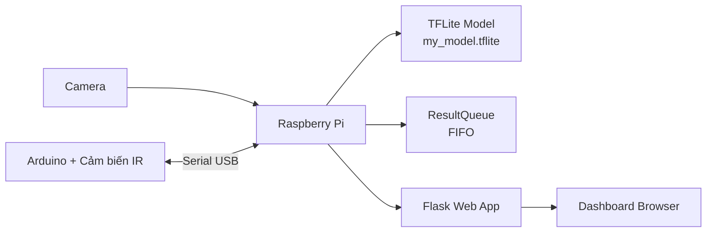

# Hệ Thống Phân Loại Linh Kiện (Raspberry Pi + TensorFlow Lite + Arduino)

## Giới thiệu

Hệ thống phân loại linh kiện thời gian thực trên Raspberry Pi: Camera → AI (TensorFlow Lite) → Serial → Arduino (3 servo gạt).

**Kiến trúc 5-layer:** Model | Camera | Communication | Storage | Queue

## Mục lục

1. [Cài đặt & Chạy](#cài-đặt)
2. [Kiến trúc](#kiến-trúc-hệ-thống)
3. [Giao thức Serial](#giao-thức-serial-pi-arduino)
4. [Mapping Servo](#mapping-nhãn-sang-tín-hiệu--servo-timing)
5. [Cấu hình Arduino](#cấu-hình-arduino)
6. [API & Xử lý sự cố](#api-hiện-có)

## Tính năng

- Phân loại `.tflite` với threshold 0.7 (unknown → không gạt servo)
- 3 servo gạt (Capacitor: 4s, IC: 5s, Transistor: 6s)
- Picamera2 + ISP convergence
- SQLite lưu lịch sử
- Dashboard web + API
- Graceful degradation khi TensorFlow không có

## Kiến trúc hệ thống

Luồng tổng quát:

1. **Phát hiện**: Cảm biến IR_1_PI_SNAP phát hiện vật → Arduino gửi `DETECTED` đến Pi
2. **Chụp & Phân loại**: Raspberry Pi chụp ảnh, chạy AI, ánh xạ nhãn thành mã tín hiệu (`0`, `1`, `2`)
3. **Gạt linh kiện**: Pi gửi signal tới Arduino, Arduino kick servo tương ứng sau delay (Capacitor: 4s, IC: 5s, Transistor: 6s)
4. **Hiển thị**: Web frontend gọi API định kỳ để cập nhật dữ liệu hiển thị

## Sơ đồ Mermaid

### 1) Sơ đồ kiến trúc tổng thể


```mermaid
flowchart LR
    CAM[Camera] --> PI[Raspberry Pi]
    ARD[Arduino + Cảm biến IR] <-->|Serial USB| PI
    PI --> AI[TFLite Model
    my_model.tflite]
    PI --> Q[ResultQueue
    FIFO]
    PI --> WEB[Flask Web App]
    WEB --> UI[Dashboard Browser]
```


## Cấu trúc thư mục

```
PBL5/
├── src/              # 5-layer architecture
│   ├── config.py
│   ├── controller.py
│   ├── model/          # AI inference
│   ├── camera/         # Picamera2
│   ├── communication/  # Serial protocol
│   ├── storage/        # SQLite
│   └── queue/          # Signal queue
├── Web/              # Flask app
├── Models/           # TensorFlow Lite model + labels
├── data/             # SQLite database
└── run.py
```


## Cài đặt & Chạy

```bash
# Setup
python3 -m venv .venv
source .venv/bin/activate
pip install -r requirements.txt

# Run
python run.py
```

Mặc định: `http://0.0.0.0:5000`

## Giao thức Serial Pi-Arduino

| Arduino → Pi | Pi → Arduino |
|---|---|
| `DETECTED` | `"0"` = servo1 (Capacitor, delay 4s) |
| `SYSTEM_READY` | `"1"` = servo2 (IC, delay 5s) |
| | `"2"` = servo3 (Transistor, delay 6s) |
| | `` (empty) = unknown (no kick) |

## Mapping Nhãn → Signal → Servo

| Nhãn | Signal | Servo Pin | Delay | Kick Angle |
|------|--------|-----------|-------|-----------|
| Capacitor | `0` | 8 | 4000ms | 130° |
| IC | `1` | 9 | 5000ms | 130° |
| Transistor | `2` | 10 | 6000ms | 130° |
| unknown | — | — | — | — |

## API Hiện Có

- `GET /` - Dashboard
- `GET /video_feed` - Camera stream
- `GET /result` - System status (JSON)
- `POST /trigger` - Test detection
- `POST /start`, `/stop` - Control system

## Cấu hình Arduino

| Thành phần | Chi tiết |
|---|---|
| IR Sensor | Pin 2 (INPUT, Active LOW) |
| Servo1 | Pin 8 (Capacitor) |
| Servo2 | Pin 9 (IC) |
| Servo3 | Pin 10 (Transistor) |
| Serial | `/dev/ttyUSB0` (9600 baud) |
| Servo Config | SERVO_HOME=0°, SERVO_KICK=130°, KICK_HOLD_TIME=2500ms |

## Phụ thuộc

### Chính (Required)
- Flask==3.0.3
- pyserial==3.5
- Pillow==10.0.0
- numpy==1.24.3
- Werkzeug==3.0.1

### Tuỳ chọn (Optional)
- `tflite-runtime==2.14.0` - AI inference (graceful degradation nếu không có)
- `picamera2` - Camera Picamera2 (pre-installed trên Raspberry Pi OS)
- `libcamera` - Libcamera backend (pre-installed trên Raspberry Pi OS)

**Lưu ý**: Picamera2 và libcamera thường đã có sẵn trên Raspberry Pi OS, không cần cài thêm.
