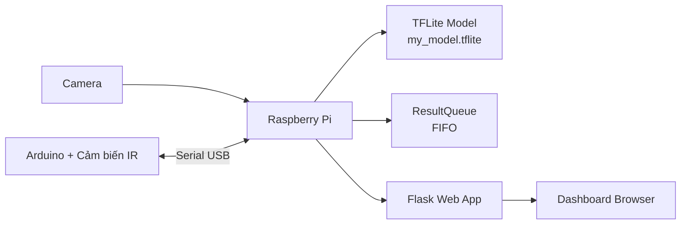
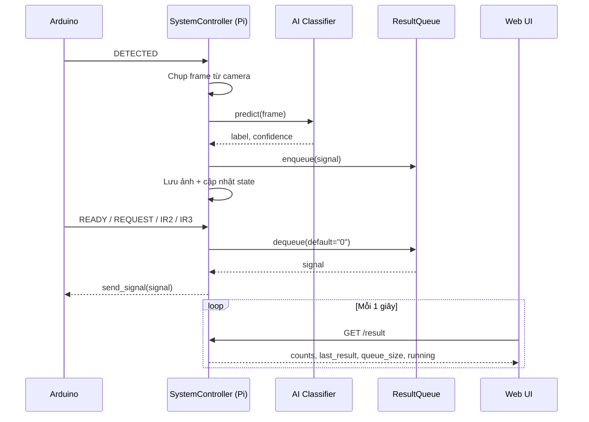

# Hệ Thống Phân Loại Linh Kiện (Raspberry Pi + TensorFlow Lite + Arduino)

## Giới thiệu

Đây là dự án phân loại linh kiện theo thời gian thực, sử dụng camera Raspberry Pi kết hợp AI (TensorFlow Lite) trên Raspberry Pi, đồng thời giao tiếp với Arduino qua Serial để điều khiển cơ cấu phân loại.

**Kiến trúc AI+IoT 5 lớp độc lập:**
- **Lớp Model**: Suy luận AI (TensorFlow Lite) - graceful degradation nếu không có TensorFlow
- **Lớp Camera**: Quản lý camera Picamera2 với ISP convergence
- **Lớp Communication**: Giao thức Serial với Arduino (DETECTED/READY/REQUEST)
- **Lớp Storage**: Lưu trữ SQLite cho lịch sử phát hiện
- **Lớp Queue**: Hàng đợi FIFO thread-safe để đồng bộ kết quả

Ngoài ra: **Lớp Configuration** tập trung hóa cấu hình, **Flask Factory** tách biệt Flask khỏi business logic.

## Mục lục

1. [Tính năng nổi bật](#tính-năng-nổi-bật)
2. [Kiến trúc hệ thống](#kiến-trúc-hệ-thống)
3. [Sơ đồ Mermaid](#sơ-đồ-mermaid)
4. [Cấu trúc thư mục](#cấu-trúc-thư-mục)
5. [Yêu cầu môi trường](#yêu-cầu-môi-trường)
6. [Cài đặt](#cài-đặt)
7. [Chạy hệ thống](#chạy-hệ-thống)
8. [API hiện có](#api-hiện-có)
9. [Giao thức Serial Pi-Arduino](#giao-thức-serial-pi-arduino)
10. [Lưu trữ SQLite](#lưu-trữ-sqlite)
11. [Mapping nhãn sang tín hiệu](#mapping-nhãn-sang-tín-hiệu)
12. [Mô tả các module chính](#mô-tả-các-module-chính)
13. [Xử lý sự cố](#xử-lý-sự-cố)
14. [Phụ thuộc](#phụ-thuộc)

## Tính năng nổi bật

- ✅ Phân loại linh kiện bằng mô hình `.tflite` với xác suất (softmax output)
- ✅ Graceful degradation: Chạy camera+serial khi TensorFlow không có
- ✅ Camera Picamera2 với ISP convergence (hội tụ ISP sau 2s)
- ✅ Threshold tin cậy 0.7: Khi confidence < 0.7 → "unknown" (không gửi signal)
- ✅ Đồng bộ kết quả bằng `ResultQueue` để tránh lệch nhịp giữa detect và cơ cấu
- ✅ Giao tiếp serial với Arduino qua `/dev/ttyUSB0`
- ✅ Lưu dữ liệu phát hiện vào SQLite (với probability distribution)
- ✅ Dashboard web hiển thị: camera stream, ảnh chụp, đếm từng loại, độ tin cậy
- ✅ Kiến trúc layered: Model, Camera, Communication, Storage, Queue

## Kiến trúc hệ thống

Luồng tổng quát:

1. Arduino gửi `DETECTED` khi cảm biến phát hiện vật.
2. Raspberry Pi chụp ảnh, chạy AI, ánh xạ nhãn thành mã tín hiệu (`1`, `2`, `3`) và đưa vào queue.
3. Khi Arduino gửi `READY`/`REQUEST`/`IR2`/`IR3`, Raspberry Pi lấy phần tử đầu queue và gửi ngược lại.
4. Web frontend gọi API định kỳ để cập nhật dữ liệu hiển thị.

## Sơ đồ Mermaid

### 1) Sơ đồ kiến trúc tổng thể


```mermaid
flowchart LR
    CAM[Camera] --> PI[Raspberry Pi]
    ARD[Arduino + Cảm biến IR] <-->|Serial USB| PI
    PI --> AI[TFLite Model
    my_model.tflite]
    PI --> Q[ResultQueue
    FIFO]
    PI --> WEB[Flask Web App]
    WEB --> UI[Dashboard Browser]
```

### 2) Sơ đồ luồng xử lý thời gian thực


```mermaid
sequenceDiagram
    participant A as Arduino
    participant C as SystemController (Pi)
    participant M as AI Classifier
    participant Q as ResultQueue
    participant W as Web UI

    A->>C: DETECTED
    C->>C: Chụp frame từ camera
    C->>M: predict(frame)
    M-->>C: label, confidence
    C->>Q: enqueue(signal)
    C->>C: Lưu ảnh + cập nhật state

    A->>C: READY / REQUEST / IR2 / IR3
    C->>Q: dequeue(default="0")
    Q-->>C: signal
    C-->>A: send_signal(signal)

    loop Mỗi 1 giây
        W->>C: GET /result
        C-->>W: counts, last_result, queue_size, running
    end
```

## Cấu trúc thư mục

```text
PBL5/
├── run.py                          # Entry point chính
├── requirements.txt                # Phụ thuộc Python
├── README.md                       # Tài liệu này
├── Models/
│   ├── my_model.tflite            # Model phân loại TensorFlow Lite
│   └── labels.txt                 # Danh sách nhãn (Capacitor, IC, Transistor)
├── src/                           # **5-LAYER ARCHITECTURE**
│   ├── config.py                  # Configuration & ControllerFactory (tập trung cấu hình)
│   ├── controller.py              # SystemController - bộ điều phối trung tâm
│   ├── model/                     # **LAYER 1: AI Model**
│   │   ├── __init__.py
│   │   ├── classifier.py          # ComponentClassifier (suy luận AI)
│   │   └── model_loader.py        # TFLiteModelLoader (load model, preprocessing)
│   ├── camera/                    # **LAYER 2: Camera Hardware**
│   │   ├── __init__.py
│   │   └── camera_manager.py      # CameraManager (Picamera2, ISP convergence)
│   ├── communication/             # **LAYER 3: Serial Protocol**
│   │   ├── __init__.py
│   │   ├── serial_comm.py         # SerialComm (low-level serial I/O)
│   │   └── arduino_protocol.py    # ArduinoProtocol (message routing)
│   ├── storage/                   # **LAYER 4: Data Persistence**
│   │   ├── __init__.py
│   │   └── database.py            # DetectionDatabase (SQLite wrapper)
│   └── queue/                     # **LAYER 5: Signal Queue**
│       ├── __init__.py
│       └── queue_manager.py       # ResultQueue (FIFO thread-safe)
├── Web/                           # Flask Web Layer
│   ├── app.py                     # Entry point (backward compatibility)
│   ├── app_factory.py             # Flask factory pattern (absolute paths)
│   ├── routes.py                  # API endpoints (/, /video_feed, /result, etc.)
│   ├── utils.py                   # Web utilities
│   ├── static/
│   │   ├── style.css
│   │   ├── script.js
│   │   └── captures/              # Thư mục lưu ảnh chụp
│   └── teamplates/
│       ├── index.html             # Dashboard web
│       └── history.html           # Lịch sử phát hiện
├── tests/
│   └── test_model.py              # Unit test model loading & prediction
└── data/
    └── PBL5.db                    # SQLite database (tự động tạo)
```

**Ưu điểm kiến trúc layered:**
- ✅ Mỗi layer độc lập, có interface rõ ràng
- ✅ Dễ test, debug, bảo trì
- ✅ Graceful degradation nếu layer nào không available
- ✅ Tách biệt concerns (Model ≠ Camera ≠ Serial)

## Yêu cầu môi trường

- **OS**: Linux (khuyến nghị Raspberry Pi OS)
- **Python**: 3.10 trở lên
- **Camera**: Picamera2 kết nối với Raspberry Pi (hỗ trợ ISP convergence)
- **Arduino**: Kết nối serial USB tại `/dev/ttyUSB0`
- **Dependencies chính**:
  - Flask 3.0.3 - Web framework
  - TensorFlow Lite (`tflite-runtime`) - **OPTIONAL** (graceful degradation nếu không có)
  - pyserial 3.5 - Serial communication
  - Pillow 10.0.0 - Image processing
  - numpy 1.24.3 - Numerical computing
  - Werkzeug 3.0.1 - WSGI utilities

## Cài đặt

```bash
python3 -m venv .venv
source .venv/bin/activate
pip install --upgrade pip
pip install -r requirements.txt
```

## Chạy hệ thống

Chạy entrypoint chính:

```bash
python run.py
```

Mặc định ứng dụng chạy tại `0.0.0.0:5000`.

Tùy chỉnh host/port bằng biến môi trường:

```bash
HOST=0.0.0.0 PORT=5000 python run.py
```

Truy cập dashboard:

- `http://<IP_RaspberryPi>:5000/`

## API hiện có

- `GET /`: Trang dashboard.
- `GET /video_feed`: Stream camera dạng multipart (frame PNG).
- `GET /result`: Trả JSON trạng thái tổng hợp.
  - Trường `labels` chứa danh sách nhãn theo thứ tự cấu hình.
- `POST /trigger`: Kích hoạt 1 lượt detect thủ công (phục vụ test).
- `POST /start`: Khởi động controller.
- `POST /stop`: Dừng controller.

## Lưu trữ SQLite

Mỗi lần hệ thống phát hiện và phân loại xong, một bản ghi được lưu vào bảng `detections` với schema sau:

- `id`: khóa chính tự tăng.
- `accessory`: tên linh kiện được dự đoán.
- `confident`: độ tin cậy của mô hình.
- `timestamp`: thời điểm ghi nhận kết quả.
- `image_path`: đường dẫn ảnh đã chụp.

Bảng được tạo tự động khi ứng dụng khởi động. File database mặc định nằm tại `data/PBL5.db`.

## Giao thức Serial Pi-Arduino

### Arduino -> Raspberry Pi

- `DETECTED`: Có vật tại vị trí chụp ảnh, Pi sẽ chụp + phân loại + enqueue.
- `READY` / `REQUEST` / `IR2` / `IR3`: Yêu cầu Pi trả tín hiệu phân loại tiếp theo.

### Raspberry Pi -> Arduino

- `1`, `2`, `3`: Mã phân loại tương ứng thứ tự nhãn trong `Models/labels.txt`.
- `0`: Không có kết quả hợp lệ hoặc queue rỗng.

## Mapping nhãn sang tín hiệu

`SystemController` tạo mapping theo thứ tự nhãn trong `Models/labels.txt`:

- Dòng 1 -> tín hiệu `1`
- Dòng 2 -> tín hiệu `2`
- Dòng 3 -> tín hiệu `3`

Ví dụ hiện tại:

1. Capacitor -> `1`
2. IC -> `2`
3. Transistor -> `3`

## Mô tả các module chính

### Lớp Configuration & Orchestration
- **`src/config.py`**: Tập trung cấu hình (MODEL_PATH, SERIAL_PORT, BAUDRATE, etc), ControllerFactory pattern
- **`src/controller.py`**: SystemController - bộ điều phối trung tâm, orchestrate tất cả 5 layers

### **LAYER 1: Model (AI Inference)**
- **`src/model/model_loader.py`**: TFLiteModelLoader - Load model, decode labels, preprocessing đầu vào
- **`src/model/classifier.py`**: ComponentClassifier - Suy luận AI, trả về (label, confidence, probabilities_dict)
- Đặc biệt: Threshold 0.7, nếu confidence < 0.7 → label="unknown"
- Graceful degradation: Warning nếu TensorFlow không có, hệ thống vẫn chạy (camera+serial)

### **LAYER 2: Camera (Hardware Abstraction)**
- **`src/camera/camera_manager.py`**: CameraManager - Quản lý Picamera2, ISP convergence (2s wait)
- Methods: `initialize()`, `read_frame()`, `close()`

### **LAYER 3: Communication (Serial Protocol)**
- **`src/communication/serial_comm.py`**: SerialComm - Low-level serial I/O với Arduino
- **`src/communication/arduino_protocol.py`**: ArduinoProtocol - Xử lý message routing (DETECTED, READY, REQUEST, IR2, IR3)
- Đặc biệt: Nếu label="unknown", không gửi signal

### **LAYER 4: Storage (Data Persistence)**
- **`src/storage/database.py`**: DetectionDatabase - Wrapper SQLite thread-safe
- Schema: id, accessory, confident, timestamp, image_path
- Tự động tạo bảng khi khởi động

### **LAYER 5: Queue (Signal Synchronization)**
- **`src/queue/queue_manager.py`**: ResultQueue - FIFO queue thread-safe cho tín hiệu phân loại

### Web Layer
- **`Web/app_factory.py`**: Flask factory pattern, absolute path resolution
- **`Web/routes.py`**: API endpoints (/, /video_feed, /result, /trigger, /start, /stop, /history-data)
- **`Web/utils.py`**: Utility functions (normalize_image_url)
- **`Web/app.py`**: Entry point (backward compatibility, dùng app_factory)

### Utilities
- **`run.py`**: Main entry point, khởi động Flask app từ app_factory
- **`tests/test_model.py`**: Unit test model loading & prediction API

## Xử lý sự cố

### Không mở được serial `/dev/ttyUSB0`

- Kiểm tra quyền truy cập:
  ```bash
  ls -l /dev/ttyUSB0
  ```
- Thêm user vào nhóm `dialout` nếu cần:
  ```bash
  sudo usermod -a -G dialout $USER
  ```
- Đăng xuất/đăng nhập lại sau khi thêm nhóm.

### Không nhận camera

- Kiểm tra kết nối camera ribbon cable (CSI port)
- Kiểm tra camera đã enabled trong raspi-config:
  ```bash
  sudo raspi-config
  # Interface Options → Camera → Enable
  ```
- Hệ thống sử dụng Picamera2 với libcamera backend
- Đảm bảo camera không bị tiến trình khác chiếm dụng

### Lỗi model hoặc labels

- Đảm bảo tồn tại đủ 2 file:
  - `Models/my_model.tflite`
  - `Models/labels.txt`
- Số lượng labels nên khớp với số class output của model

### TensorFlow không cài đặt

- Hệ thống sẽ chạy ở chế độ **graceful degradation**
- Warning: "AI model layer unavailable"
- Camera + Serial vẫn hoạt động bình thường
- Để cài đặt TensorFlow:
  ```bash
  pip install tflite-runtime
  ```

## Changelog - Phiên Bản 2.0

### 🏗️ Refactoring Kiến Trúc
Nâng cấp từ monolithic controller lên **5-layer architecture** với separation of concerns:
- **Layer 1 - Model**: AI inference (TFLite) độc lập
- **Layer 2 - Camera**: Hardware abstraction cho Picamera2
- **Layer 3 - Communication**: Protocol handler cho Arduino serial
- **Layer 4 - Storage**: SQLite persistence wrapper
- **Layer 5 - Queue**: FIFO signal queue thread-safe
- **Config Layer**: Tập trung cấu hình (config.py)
- **Web Layer**: Flask factory pattern (app_factory.py, routes.py, utils.py)

### 🎯 Xử Lý "Unknown" Predictions
Đã điều chỉnh logic model prediction để:
1. Lấy **softmax output (xác suất)** cho tất cả các class
2. Nếu confidence < **0.7** → coi là **"unknown"**
3. Trả về **probability distribution** cùng với kết quả prediction
4. Khi kết quả là `unknown`, **không gửi bất kỳ tín hiệu nào** tới Arduino

### ✅ Lợi ích Chính
- **Graceful Degradation**: Chạy camera+serial ngay cả khi TensorFlow không có
- **Dễ Test & Maintain**: Mỗi layer có interface rõ ràng, độc lập
- **Absolute Path Resolution**: Flask template/static paths giải quyết được trên mọi environment
- **Better Error Handling**: Các layer có cơ chế fallback
- **Clean Separation**: AI ≠ Hardware ≠ Protocol ≠ Storage

### 📝 Chi Tiết Các File Thay Đổi

#### Tổ chức lại (Restructured)
- `src/image_processing.py` → `src/model/classifier.py`
- `src/model_loader.py` → `src/model/model_loader.py`
- `src/serial_comm.py` → `src/communication/serial_comm.py`
- `src/database.py` → `src/storage/database.py`
- `src/queue_manager.py` → `src/queue/queue_manager.py`

#### File Mới (New)
- `src/config.py` - Configuration & ControllerFactory
- `src/camera/camera_manager.py` - Camera hardware abstraction
- `src/communication/arduino_protocol.py` - Protocol message handler
- `Web/app_factory.py` - Flask factory pattern
- `Web/routes.py` - API endpoints
- `Web/utils.py` - Web utilities
- `tests/` folder - Unit tests

#### File Cập Nhật (Updated)
- `src/controller.py` - Simplify to orchestration only, delegate to layers
- `Web/app.py` - Use app_factory pattern
- `run.py` - Use app_factory with root_path handling
- All `__init__.py` files - Export layer modules

**Scenario 1: High confidence (≥ 0.7)**
```json
{
  "label": "Capacitor",
  "confidence": 0.95,
  "signal": "1",
  "probabilities": {
    "Capacitor": 0.95,
    "IC": 0.04,
    "Transistor": 0.01
  }
}
```
Action: ✅ Enqueue → Gửi signal "1" tới Arduino

**Scenario 2: Low confidence (< 0.7)**
```json
{
  "label": "unknown",
  "confidence": 0.68,
  "signal": "",
  "probabilities": {
    "Capacitor": 0.35,
    "IC": 0.33,
    "Transistor": 0.32
  }
}
```
Action: ❌ Không enqueue → Không gửi bất kỳ signal nào

### Lợi ích

1. **Tránh False Positives**: Không accept prediction kém tin cậy
2. **Chuỗi "unknown"**: Dễ track những trường hợp mơ hồ
3. **Debug tốt hơn**: Thấy full probability distribution
4. **Linh hoạt**: Có thể thay đổi threshold nếu cần

### Database
- `accessory` column sẽ có giá trị `"unknown"` khi prediction không tự tin
- `confident` column sẽ ghi confidence score ngay cả cho "unknown"
- Thêm field `probabilities` vào JSON response của API web

### Cách tuỳ chỉnh threshold

```python
# Default threshold 0.7
label, conf, probs = classifier.predict(frame)

# Threshold cao hơn (strict)
label, conf, probs = classifier.predict(frame, confidence_threshold=0.9)

# Threshold thấp hơn (lenient)
label, conf, probs = classifier.predict(frame, confidence_threshold=0.5)
```

## Phụ thuộc

### Chính (Required)
- Flask==3.0.3
- pyserial==3.5
- Pillow==10.0.0
- numpy==1.24.3
- Werkzeug==3.0.1

### Tuỳ chọn (Optional)
- `tflite-runtime==2.14.0` - AI inference (graceful degradation nếu không có)
- `picamera2` - Camera Picamera2 (pre-installed trên Raspberry Pi OS)
- `libcamera` - Libcamera backend (pre-installed trên Raspberry Pi OS)

**Lưu ý**: Picamera2 và libcamera thường đã có sẵn trên Raspberry Pi OS, không cần cài thêm.
